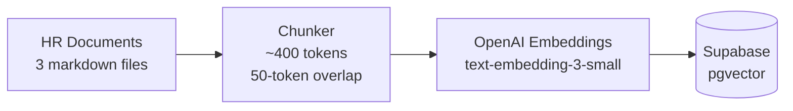
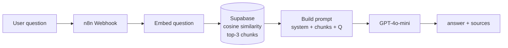
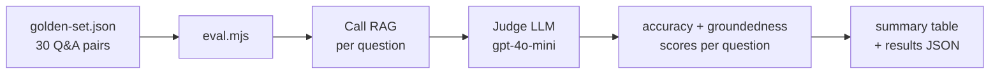

# HR Onboarding RAG Assistant

A retrieval-augmented generation system that answers new-hire questions over a synthetic employee handbook. The system is evaluated against a 30-question golden set, scoring each answer on accuracy and groundedness independently.

The eval harness is the primary engineering contribution — most RAG demos measure nothing. Having structured, reproducible evaluation separates implementation from engineering.

---

## Evaluation results

**Phase 1 — Mock baseline (2026-06-12)**

| Metric | Result |
|--------|--------|
| Pass rate | 17% (5 / 30) |
| Avg accuracy | 1.73 / 5 |
| Avg groundedness | 2.07 / 5 |

These are mock baseline numbers, run before the retrieval system existed — the expected result when the eval harness itself is under test. The harness correctly identified factual errors in mock answers (Q08: pension contribution stated as 4%, correct is 5%; A:2, G:5) and correctly scored non-answers as 1/1.

Full methodology and result interpretation: [docs/eval-methodology.md](docs/eval-methodology.md) · [docs/eval-results.md](docs/eval-results.md)

---

## System architecture

See [docs/architecture.md](docs/architecture.md) for annotated diagrams of all three pipelines. Overview below.

**Ingestion pipeline** — runs once to populate the vector store:



**Query pipeline** — runs per user message:



**Eval pipeline** — runs after every system change:



---

## Build log

| Phase | What I built | Status | Documentation |
|-------|-------------|--------|---------------|
| 1 | Synthetic HR docs, 30-question golden eval set, eval harness | ✅ Complete | [phase-1-foundation.md](docs/phase-1-foundation.md) |
| 2 | Supabase setup, document ingestion pipeline | 🔧 In progress | [phase-2-ingestion.md](docs/phase-2-ingestion.md) |
| 3 | n8n RAG flow: retrieval + generation + persistent memory | Pending Phase 2 | — |
| 4 | Live eval run, result publication | Pending Phase 3 | — |
| 5 | Next.js chat UI, public deployment | Pending Phase 4 | — |

---

## Running the eval

```bash
git clone https://github.com/FlowFusionAI/hr-onboarding-rag
cd hr-onboarding-rag
cp .env.example .env   # add OPENAI_API_KEY

# Mock mode — validates the eval harness without a live RAG endpoint
npm run eval:mock

# Live mode — requires RAG_URL set to a running n8n webhook
npm run eval:live
```

---

## Repository structure

```
hr-onboarding-rag/
├── hr-docs/                   source HR documents (ingested into vector DB)
│   ├── employee-handbook.md
│   ├── onboarding-checklist.md
│   └── role-faqs.md
├── eval/                      evaluation harness
│   ├── eval.mjs               automated scoring script
│   ├── golden-set.json        30 Q&A pairs across 14 categories
│   └── results-*.json         eval run outputs
├── docs/                      project documentation
│   ├── architecture.md
│   ├── eval-methodology.md
│   ├── eval-results.md
│   ├── phase-1-foundation.md
│   └── phase-2-ingestion.md
├── .env.example               environment variable template
└── package.json
```

---

## Stack

| Layer | Technology | Notes |
|-------|-----------|-------|
| Embeddings | OpenAI `text-embedding-3-small` | 1536-dim vectors, ~$0.02/million tokens |
| Generation | OpenAI `gpt-4o-mini` | ~$0.15/million input tokens |
| Vector store | Supabase + pgvector | Cosine similarity search |
| Orchestration | n8n | Webhook-triggered RAG flow |
| Frontend | Next.js + TypeScript | Deployed on Vercel |
| Eval judge | OpenAI `gpt-4o-mini` | Structured JSON output, `temperature=0` |
