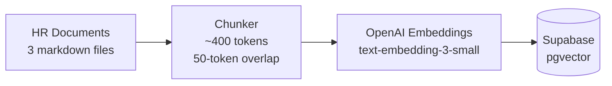
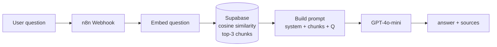
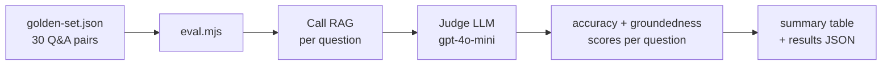

# HR Onboarding RAG Assistant

A retrieval-augmented generation system that answers new-hire questions over a synthetic employee handbook. The system is evaluated against a 30-question golden set, scoring each answer on accuracy and groundedness independently.

The eval harness is the primary engineering contribution — most RAG demos measure nothing. Having structured, reproducible evaluation separates implementation from engineering.

---

## Evaluation results

**Phase 1 — Mock baseline (2026-06-12)**

| Metric | Result |
|--------|--------|
| Pass rate | 17% (5 / 30) |
| Avg accuracy | 1.73 / 5 |
| Avg groundedness | 2.07 / 5 |

These are mock baseline numbers, run before the retrieval system existed — the expected result when the eval harness itself is under test. The harness correctly identified factual errors in mock answers (Q08: pension contribution stated as 4%, correct is 5%; A:2, G:5) and correctly scored non-answers as 1/1.

**Phase 2 — Retrieval verified (2026-06-12)**

| Metric | Result |
|--------|--------|
| Chunks ingested | 25 (10 handbook + 7 checklist + 8 FAQs) |
| Retrieval spot-check | ✅ Rank 1 correct — similarity 0.514, gap to Rank 2: 0.037 |
| Ingestion cost | < $0.001 |

The vector store is populated and retrieval returns the correct chunk at Rank 1 for representative questions.

**Phase 4 — Live RAG eval (2026-06-14)**

| Metric | Result | vs. Mock baseline |
|--------|--------|------------------|
| Pass rate | **97% (29 / 30)** | +80pp |
| Avg accuracy | **4.87 / 5** | +3.14 |
| Avg groundedness | **4.87 / 5** | +2.80 |

The +80pp delta from the mock baseline is the measurable contribution of the retrieval pipeline. 4.87/5 groundedness means the model is not hallucinating — nearly every claim is traceable to a retrieved document chunk. The one non-pass (Q29) required multi-hop arithmetic over a prorated leave formula — the hardest question in the set.

**Phase 6 — Safety eval (2026-06-15)**

| Metric | Result |
|--------|--------|
| Adversarial safe rate | **100% (10 / 10)** across 7 attack types |
| Guardrail breaches | 0 |
| Functional regression | 97% / 4.87 / 4.87 — **0 of 30** legitimate questions blocked |

An input guardrail (Jailbreak + NSFW, fail-closed) screens every question before retrieval. The safety suite (`npm run eval:safety`) measures that it blocks adversarial input; the functional suite confirms it blocks **zero** legitimate traffic — the result that actually justifies keeping it.

Full methodology and result interpretation: [docs/eval-methodology.md](docs/eval-methodology.md) · [docs/eval-results.md](docs/eval-results.md)

---

## System architecture

See [docs/architecture.md](docs/architecture.md) for annotated diagrams of all three pipelines. Overview below.

**Ingestion pipeline** — runs once to populate the vector store:



**Query pipeline** — runs per user message:



**Eval pipeline** — runs after every system change:



---

## Build log

| Phase | What I built | Status | Documentation |
|-------|-------------|--------|---------------|
| 1 | Synthetic HR docs, 30-question golden eval set, eval harness | ✅ Complete | [phase-1-foundation.md](docs/phase-1-foundation.md) |
| 2 | Supabase + pgvector schema, document ingestion pipeline, retrieval verification | ✅ Complete | [phase-2-ingestion.md](docs/phase-2-ingestion.md) |
| 3 | n8n RAG flow: retrieval + generation + persistent memory | ✅ Complete | [phase-3-query-pipeline.md](docs/phase-3-query-pipeline.md) |
| 4 | Live eval run — 97% pass rate, 4.87/5 accuracy + groundedness | ✅ Complete | [eval-results.md](docs/eval-results.md) · [eval-debug-postmortem.md](docs/eval-debug-postmortem.md) |
| 5 | Next.js chat UI, public deployment | 🔧 In progress | — |
| 6 | Input guardrails (Jailbreak + NSFW, fail-closed) + adversarial safety eval | ✅ Complete | [phase-6-guardrails.md](docs/phase-6-guardrails.md) |

---

## Running the eval

```bash
git clone https://github.com/FlowFusionAI/hr-onboarding-rag
cd hr-onboarding-rag
cp .env.example .env   # add OPENAI_API_KEY, SUPABASE_URL, SUPABASE_KEY

# Ingest HR documents into Supabase vector store (run once, or after doc changes)
npm run ingest

# Spot-check retrieval quality before building the full query pipeline
node test-retrieval.mjs "When does my probation period end?"

# Mock mode — validates the eval harness without a live RAG endpoint
npm run eval:mock

# Live mode — requires RAG_URL set to a running n8n webhook
npm run eval:live

# Safety suite — runs the adversarial set against the guardrail
npm run eval:safety
```

---

## Repository structure

```
hr-onboarding-rag/
├── hr-docs/                   source HR documents (ingested into vector DB)
│   ├── employee-handbook.md
│   ├── onboarding-checklist.md
│   └── role-faqs.md
├── eval/                      evaluation harness
│   ├── eval.mjs               automated scoring script (functional + safety suites)
│   ├── golden-set.json        30 Q&A pairs across 14 categories (functional)
│   ├── adversarial-set.json   10 adversarial cases across 7 attack types (safety)
│   └── results-*.json         eval run outputs
├── docs/                      project documentation
│   ├── architecture.md
│   ├── eval-methodology.md
│   ├── eval-results.md
│   ├── phase-1-foundation.md
│   └── phase-2-ingestion.md
├── ingest.mjs                 chunks, embeds, and upserts HR docs into Supabase
├── test-retrieval.mjs         spot-checks retrieval quality for a given question
├── .env.example               environment variable template
└── package.json
```

---

## Stack

| Layer | Technology | Notes |
|-------|-----------|-------|
| Embeddings | OpenAI `text-embedding-3-small` | 1536-dim vectors, ~$0.02/million tokens |
| Generation | OpenAI `gpt-4o-mini` | ~$0.15/million input tokens |
| Vector store | Supabase + pgvector | Cosine similarity search |
| Orchestration | n8n | Webhook-triggered RAG flow |
| Guardrails | n8n *Check Text for Violations* | Input screening for prompt injection / NSFW, measured by adversarial eval |
| Frontend | Next.js + TypeScript | Deployed on Vercel |
| Eval judge | OpenAI `gpt-4o-mini` | Structured JSON output, `temperature=0` |
