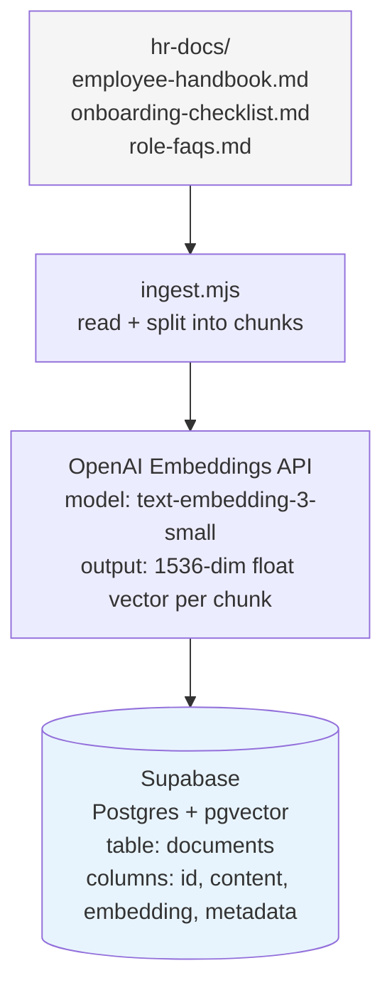
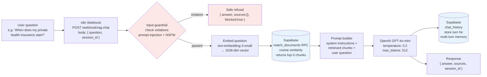
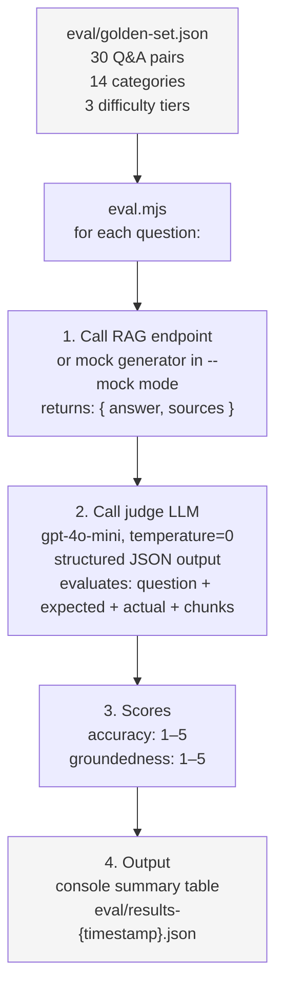

# System Architecture

This document describes the three pipelines that make up the system: ingestion, query, and evaluation. Each operates independently.

---

## 1. Ingestion Pipeline

The ingestion pipeline runs once (and re-runs whenever the source documents change). It converts plain-text HR documents into vector embeddings stored in a Postgres database with the pgvector extension.

**Chunking strategy:** Each document is split into segments of approximately 400 tokens with a 50-token overlap between adjacent chunks. The overlap preserves context across chunk boundaries — a sentence that starts near the end of one chunk and finishes at the start of the next remains retrievable in both.

**Why `text-embedding-3-small`:** It produces 1536-dimensional vectors, costs approximately $0.02 per million tokens, and performs comparably to larger embedding models on retrieval benchmarks. The full HR document set is around 5,000 tokens — the one-time ingestion cost is below $0.01.

**What gets stored:** Each row in the `documents` table holds the raw chunk text (`content`), its vector (`embedding`), and metadata such as source filename and section heading. The source metadata is returned alongside answers so a chat client can display citations.

---

## 2. Query Pipeline

The query pipeline runs per user message. It retrieves the most relevant document chunks via cosine similarity search, constructs a prompt from those chunks, and passes the prompt to the language model.

**Input guardrail:** An n8n *Check Text for Violations* node screens each question for prompt injection and NSFW content before any paid call (embed, retrieve, generate) runs. A violation short-circuits to a safe refusal in the same `{ answer, sources, session_id }` shape; a clean question proceeds unchanged. This is defense-in-depth on top of the grounding constraint, and it is measured by a dedicated adversarial eval slice — see [phase-5-guardrails.md](phase-5-guardrails.md) and [eval-methodology.md](eval-methodology.md#L131).

**Retrieval:** The user's question is embedded with the same model used during ingestion (`text-embedding-3-small`). The vector is compared against all stored chunk embeddings using cosine similarity. The top 3 chunks are returned — enough context for most HR questions without exceeding the prompt budget.

**System prompt:** The language model is instructed to answer only from the provided chunks, cite the source section for each claim, and respond with "I don't have that information in the company documents" when the relevant chunk is not retrieved. This constraint is what the groundedness dimension of the eval harness measures.

**Memory:** Each `{ question, answer }` turn is written to a `chat_history` table keyed by `session_id`. On subsequent turns in the same session, the last N turns are prepended to the prompt as conversation history, enabling follow-up questions.

**Cost per query:** ~$0.0003 (embedding) + ~$0.001 (generation) = under $0.002 per message at current OpenAI pricing.

---

## 3. Evaluation Pipeline

The eval pipeline is independent of the query pipeline — it calls the RAG endpoint as a black box and measures output quality. It runs after every change to the system prompt, chunking strategy, or embedding model.

**Two-score design:** Accuracy measures whether the answer is factually correct against the expected answer. Groundedness measures whether each claim in the answer is traceable to a retrieved chunk. The two dimensions are independent — a correct answer can be ungrounded (model guessed from training data) and a grounded answer can be inaccurate (wrong chunk retrieved, or chunk misread). Both must be high for the system to be reliable.

**Judge configuration:** The judge receives the question, expected answer, actual RAG answer, and the retrieved source chunks in a single prompt. It returns a JSON object with `accuracy`, `groundedness`, and one-sentence reasoning for each score. `temperature=0` and `response_format: json_object` are set to ensure deterministic, parseable output.

**Difficulty tiers:** The golden set contains 15 easy questions (single-section lookup), 10 medium questions (conditional answers depending on context from multiple sections), and 5 hard questions (multi-hop reasoning requiring retrieval from two or more policy sections simultaneously). Easy questions confirm basic retrieval is working. Hard questions surface retrieval precision failures that easy questions miss.

---

## Component Responsibilities

| Component | Responsibility | Technology |
|-----------|---------------|-----------|
| `hr-docs/` | Source of truth for HR policy | Markdown |
| `ingest.mjs` | Chunk, embed, and store documents | Node.js, OpenAI API |
| Supabase `documents` | Store chunk embeddings for similarity search | Postgres + pgvector |
| Supabase `chat_history` | Store conversation turns for multi-turn memory | Postgres |
| n8n workflow | Orchestrate the query pipeline | n8n |
| n8n guardrail node | Screen input for prompt injection / NSFW before paid calls | n8n Guardrails (LLM classifier) |
| `eval/golden-set.json` | Define the functional test cases (accuracy + groundedness) | JSON |
| `eval/adversarial-set.json` | Define the adversarial test cases (safety) | JSON |
| `eval/eval.mjs` | Run functional + adversarial evals and score answers | Node.js, OpenAI API |
