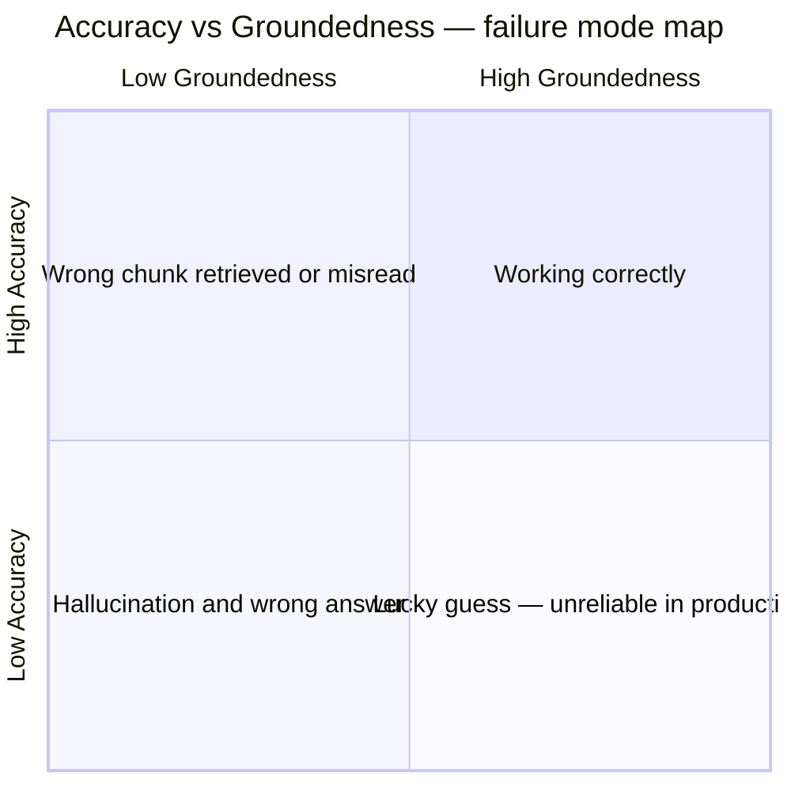

# Evaluation Methodology

This document explains how the eval harness works, why it is designed the way it is, and how to interpret the scores it produces.

---

## Why evaluate at all

A RAG system that "seems to work" in manual testing is not a RAG system that works. Manual testing covers a handful of questions chosen by the person who built the system — questions the system is likely to handle well. Systematic evaluation over a fixed question set exposes failure modes that happy-path testing misses: off-by-one facts retrieved from the wrong section, answers that are directionally correct but missing a critical condition, or hallucinated details added to a mostly-grounded response.

The evaluation harness here treats the RAG as a black box. It asks the same 30 questions every time, scores each answer the same way, and produces a summary that can be compared across runs. When the system changes — new chunking strategy, updated system prompt, different embedding model — the eval run produces a new row in the results history. Improvement (or regression) is measurable, not claimed.

---

## Scoring dimensions

The harness scores every answer on two dimensions independently.

### Accuracy (1–5)

Does the answer match the expected answer?

| Score | Meaning |
|-------|---------|
| 5 | Correct and complete. Key facts match; nothing important is missing. |
| 4 | Mostly correct. Minor omissions or slight imprecision, no factual errors. |
| 3 | Partially correct. Core fact present but important details missing or imprecise. |
| 2 | Mostly wrong. Correct direction but significant factual errors. |
| 1 | Completely wrong, refuses to answer, or answers a different question. |

### Groundedness (1–5)

Is every claim in the answer supported by the retrieved document chunks?

| Score | Meaning |
|-------|---------|
| 5 | Every claim is directly traceable to a retrieved chunk. |
| 4 | Most claims are grounded; minor details added from general knowledge. |
| 3 | Core answer is grounded but some claims go beyond the chunks. |
| 2 | The answer goes significantly beyond or contradicts the retrieved chunks. |
| 1 | The answer is not grounded in the retrieved chunks at all. |

### Why both dimensions are necessary

The two dimensions are independent. A high-accuracy, low-groundedness answer is a lucky guess — the model produced the correct answer from training data rather than from the retrieved document. This is a production reliability problem: when the policy changes and the documents are updated, a model that guesses from training data will give the old, wrong answer while a grounded model will give the new, correct one.

A high-groundedness, low-accuracy answer means the wrong chunk was retrieved, or the right chunk was misread. This is a retrieval or prompting problem, not a hallucination problem.

Only when both dimensions are high is the system behaving as designed: retrieving the right chunk and reasoning correctly from it.



---

## The judge

Each answer is scored by a second call to `gpt-4o-mini`, acting as a judge. The judge receives:

- The question
- The expected answer (from `golden-set.json`)
- The actual RAG answer
- The source chunks returned by the retrieval step

The judge is prompted to return a structured JSON object:

```json
{
  "accuracy": 4,
  "groundedness": 5,
  "accuracy_reasoning": "Answer is mostly correct but omits the 5-day carry-over limit.",
  "groundedness_reasoning": "All claims are directly supported by the retrieved chunk."
}
```

`temperature=0` and `response_format: json_object` are set to make judge outputs deterministic and parseable. The reasoning fields are recorded in `results-{timestamp}.json` and surfaced for any question scoring below 4 on either dimension.

**Why a judge LLM rather than exact-match scoring:** HR policy answers are often semantically equivalent but not lexically identical. "25 days per year" and "you are entitled to 25 days of annual leave" are the same answer. Exact-match scoring would mark the second as wrong. An LLM judge evaluates semantic equivalence and partial credit, which better reflects real retrieval quality.

**Judge reliability:** Using the same model for generation (query pipeline) and judging introduces potential bias — the judge may be lenient toward outputs that resemble its own generation style. In a production setting this would be mitigated by using a different model family for judging (e.g. Claude as judge for GPT answers). For this project, `gpt-4o-mini` is used for both because cost and simplicity are prioritised at this stage.

---

## Golden set design

The 30 questions in `eval/golden-set.json` are structured across three difficulty tiers and 14 categories.

### Difficulty tiers

| Tier | Count | Design principle |
|------|-------|-----------------|
| Easy | 15 | Single-section lookup. The answer is in one paragraph of one document. Tests whether basic retrieval works. |
| Medium | 10 | Conditional answer. The correct response depends on a condition stated elsewhere in the document (e.g. "only after probation is passed"). Tests whether the retrieval returns enough context. |
| Hard | 5 | Multi-hop reasoning. Two or more policy sections must both be retrieved and combined to produce the correct answer. Tests retrieval precision under ambiguity. |

The hard questions are the most diagnostic. A RAG that passes all easy questions but fails the hard ones has a retrieval precision problem — it retrieves plausible chunks but not the right combination.

### Categories

| Category | Questions | Sample question |
|----------|-----------|-----------------|
| leave | 6 | How many days of annual leave can I carry over? |
| benefits | 5 | When does my private health insurance start? |
| payroll | 3 | What is the deadline for changing my bank details? |
| remote-work | 3 | How long can I work from abroad without approval? |
| probation | 2 | Can my probation be extended? |
| sick-leave | 2 | What do I need to do on my first day of sickness? |
| working-hours | 2 | What core hours am I expected to be available during? |
| day-1 | 1 | How do I collect my office access card on my first day? |
| conduct | 1 | What is the maximum gift value I can accept without approval? |
| equipment | 1 | I lost my access card — will I be charged for a replacement? |
| expenses | 1 | What is the deadline for submitting an expense claim? |
| offboarding | 1 | What happens to my access card when I leave the company? |
| training | 1 | When is the deadline to complete mandatory e-learning? |
| wellbeing | 1 | Who should I contact for a confidential counselling service? |

### Pass threshold

A question passes when both accuracy ≥ 4 and groundedness ≥ 4. The overall pass rate is the proportion of the 30 questions that meet this threshold.

**Target for a production-ready system:** ≥ 80% pass rate, average accuracy ≥ 4.0, average groundedness ≥ 4.0. Below this threshold, the most common causes are chunk size too large (retrieval returns noisy context), system prompt not constraining the model to the retrieved chunks, or chunk overlap too small (sentence boundaries split across chunks that needed to stay together).

---

## Running the eval

```bash
# Mock mode — tests the eval harness itself without a live RAG
npm run eval:mock

# Live mode — tests the actual RAG system
RAG_URL=https://your-n8n-instance/webhook/rag-chat npm run eval:live

# Save results to file
npm run eval:mock -- --output
```

Results are saved to `eval/results-{timestamp}.json`. Run the eval after every change to the chunking strategy, system prompt, embedding model, or retrieval parameters (k, similarity threshold). The timestamp-keyed files form a history of how system quality evolves.
