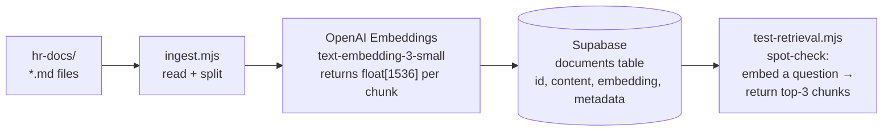

# Phase 2 — Document Ingestion

**Status:** In progress  
**Goal:** Populate the Supabase vector store with embeddings of the HR documents so that cosine similarity search returns the right passage for a given question.

---

## What ingestion does

Before a user can ask a question and get a grounded answer, the system needs to know where in the HR documents the answer lives. Ingestion is the offline process that makes this possible: it reads the three markdown documents, splits them into manageable segments, converts each segment into a vector embedding, and stores both the text and the vector in Postgres.

At query time, the user's question is embedded using the same model, and the stored vectors are searched by cosine similarity. The closest vectors correspond to the document segments most likely to contain the answer.



---

## Chunking strategy

### Why chunking is necessary

Language models and embedding models have token limits. More importantly, a chunk that is too large retrieves too much context — the relevant sentence is buried in surrounding text, and the model generates a less precise answer. A chunk that is too small may not contain a complete thought, splitting a sentence across two chunks that should have been read together.

### Parameters

| Parameter | Value | Rationale |
|-----------|-------|-----------|
| Chunk size | ~400 tokens | Long enough to contain a complete policy rule with its conditions; short enough to be specific |
| Overlap | 50 tokens | Preserves context at chunk boundaries — a condition stated at the end of one chunk is also available at the start of the next |
| Split boundary | Paragraph breaks preferred | Avoids splitting mid-sentence where possible |

These values are a starting point. The live eval run (Phase 4) will determine whether they produce sufficient retrieval quality. If medium or hard questions score poorly, reducing chunk size or increasing overlap are the first adjustments to try.

### What a chunk looks like

An example from `employee-handbook.md`, Section 7:

```
**Duration:** 3 months for all new employees.

**Review:** A formal probation review takes place at the end of month 2 (informal check-in)
and at the end of month 3 (formal sign-off). Your line manager and a People & Culture
representative will attend the month-3 review.

**Outcome:** Probation is either passed, extended (once, by up to 6 weeks), or not passed.
You will receive written confirmation within 5 working days of the review.
```

This chunk is ~90 tokens — well within the 400-token target — and contains a complete, self-contained policy statement. Questions about probation duration, probation extension, and review format can all be answered from this single chunk.

---

## Supabase schema

```sql
-- Enable the pgvector extension (done once in the Supabase dashboard)
create extension if not exists vector;

-- Documents table
create table documents (
  id          bigserial primary key,
  content     text        not null,
  embedding   vector(1536) not null,
  source_file text,
  section     text,
  created_at  timestamptz default now()
);

-- Index for fast cosine similarity search
create index on documents
  using ivfflat (embedding vector_cosine_ops)
  with (lists = 100);

-- RPC function called at query time
create or replace function match_documents (
  query_embedding vector(1536),
  match_count     int default 3
)
returns table (id bigint, content text, source_file text, section text, similarity float)
language sql stable
as $$
  select id, content, source_file, section,
         1 - (embedding <=> query_embedding) as similarity
  from documents
  order by embedding <=> query_embedding
  limit match_count;
$$;
```

The `ivfflat` index makes similarity search fast at scale. For this project's document volume (~50–80 chunks from three files) a sequential scan would be faster, but the index is included so the schema reflects production patterns.

---

## Ingestion script design

`ingest.mjs` reads each file in `hr-docs/`, splits it into chunks, embeds each chunk, and upserts the result into Supabase. Re-running it on an updated document replaces existing rows for that file.

**Environment variables required:**
```
OPENAI_API_KEY       — for embedding calls
SUPABASE_URL         — project URL from Supabase dashboard
SUPABASE_KEY         — service role key (not anon key — needs insert access)
```

**Run:**
```bash
node ingest.mjs
```

Expected output:
```
Reading hr-docs/employee-handbook.md...
  Split into 22 chunks
  Embedding chunks... done
  Upserted 22 rows → documents

Reading hr-docs/onboarding-checklist.md...
  Split into 9 chunks
  Embedding chunks... done
  Upserted 9 rows → documents

Reading hr-docs/role-faqs.md...
  Split into 11 chunks
  Embedding chunks... done
  Upserted 11 rows → documents

Ingestion complete. 42 total chunks stored.
Estimated cost: $0.0004
```

---

## Retrieval verification

Before building the full RAG flow, retrieval quality is verified in isolation using `test-retrieval.mjs`. The script takes a question as input, embeds it, runs the similarity search, and prints the top 3 retrieved chunks.

```bash
node test-retrieval.mjs "When does enhanced sick pay apply?"
```

Expected output:
```
Query: When does enhanced sick pay apply?

Rank 1 (similarity: 0.891) — employee-handbook.md § Sick Leave
Entitlement: Up to 10 days per rolling 12 months at full pay. After 10 days, Statutory
Sick Pay (SSP) applies...

Rank 2 (similarity: 0.847) — employee-handbook.md § Probation
...enhanced sick pay only applies once your probation period is passed...

Rank 3 (similarity: 0.731) — role-faqs.md § Pay and Payroll
...
```

This two-chunk result is the correct retrieval for this question — the answer requires combining the sick leave entitlement with the probation condition. If the retrieval verification passes for representative questions from each difficulty tier, Phase 3 (the n8n RAG flow) can proceed.

---

## Phase 2 completion criteria

Phase 2 is complete when:

1. `ingest.mjs` runs without errors and the `documents` table in Supabase contains rows
2. `test-retrieval.mjs` returns the correct top-1 chunk for at least 10 representative questions from the golden set
3. The Phase 2 eval run (mock baseline re-run with retrieval verification) is recorded in [docs/eval-results.md](eval-results.md)
