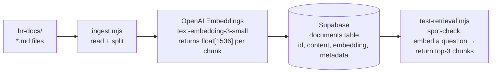
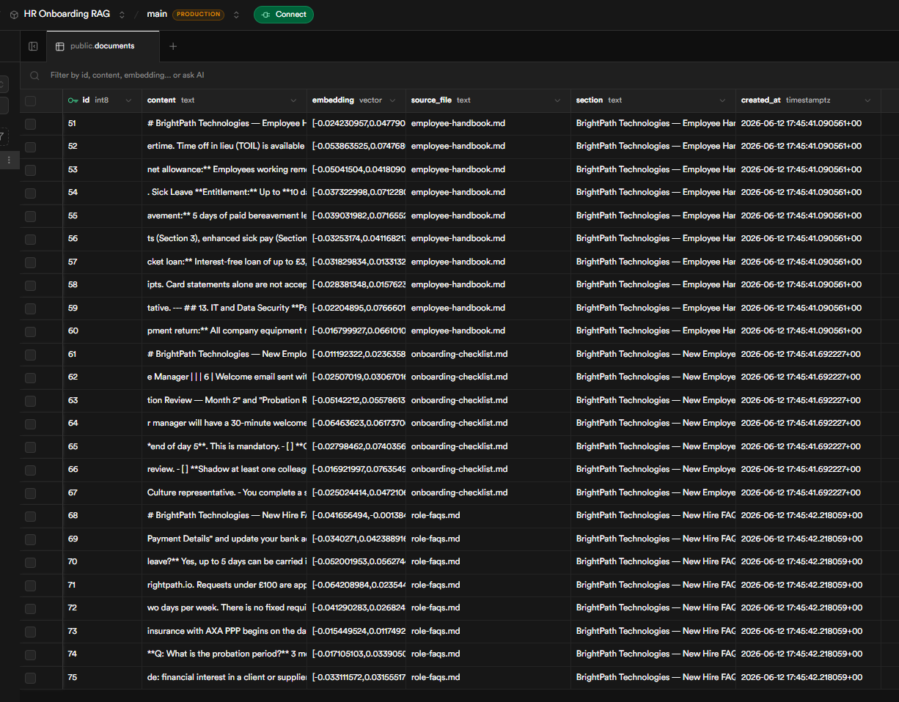
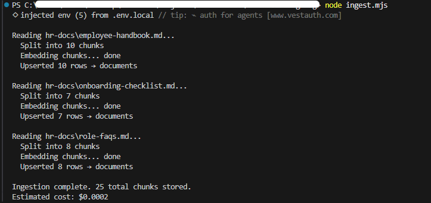
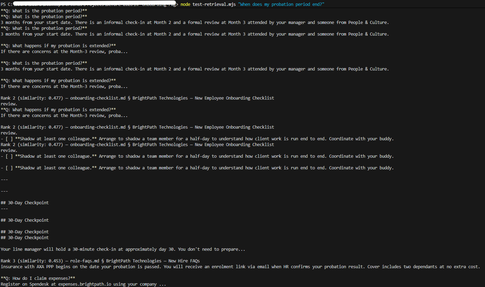
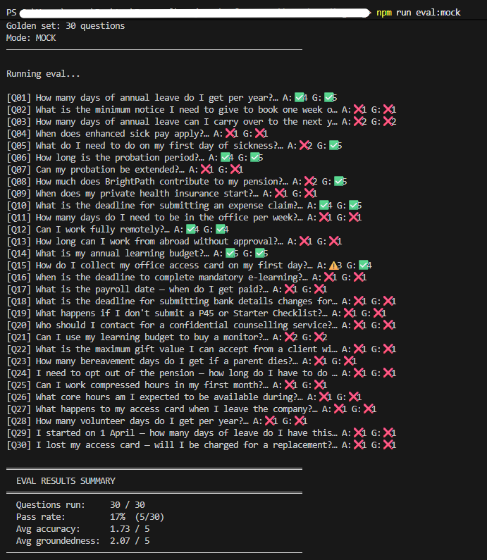
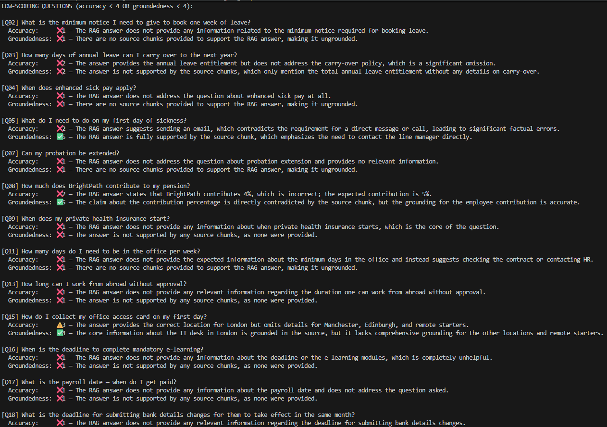
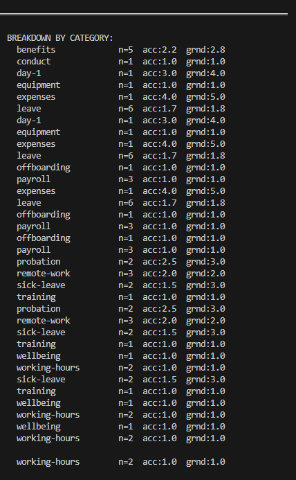

# Phase 2 — Document Ingestion

**Status:** Complete  
**Completed:** 2026-06-12  
**Goal:** Populate the Supabase vector store with embeddings of the HR documents so that cosine similarity search returns the right passage for a given question.

---

## What ingestion does

Before a user can ask a question and get a grounded answer, the system needs to know where in the HR documents the answer lives. Ingestion is the offline process that makes this possible: it reads the three markdown documents, splits them into manageable segments, converts each segment into a vector embedding, and stores both the text and the vector in Postgres.

At query time, the user's question is embedded using the same model, and the stored vectors are searched by cosine similarity. The closest vectors correspond to the document segments most likely to contain the answer.



---

## Chunking strategy

### Why chunking is necessary

Language models and embedding models have token limits. More importantly, a chunk that is too large retrieves too much context — the relevant sentence is buried in surrounding text, and the model generates a less precise answer. A chunk that is too small may not contain a complete thought, splitting a sentence across two chunks that should have been read together.

### Parameters

| Parameter | Value | Rationale |
|-----------|-------|-----------|
| Chunk size | ~400 tokens (~1,600 chars) | Long enough to contain a complete policy rule with its conditions; short enough to be specific |
| Overlap | ~50 tokens (~200 chars) | Preserves context at chunk boundaries — a condition stated at the end of one chunk is also available at the start of the next |
| Split boundary | Paragraph breaks preferred | Avoids splitting mid-sentence where possible |

These values are a starting point. The live eval run (Phase 4) will determine whether they produce sufficient retrieval quality. If medium or hard questions score poorly, reducing chunk size or increasing overlap are the first adjustments to try.

---

## Supabase schema

```sql
-- Enable the pgvector extension (done once in the Supabase dashboard)
create extension if not exists vector;

-- Documents table
create table documents (
  id          bigserial primary key,
  content     text        not null,
  embedding   vector(1536) not null,
  source_file text,
  section     text,
  created_at  timestamptz default now()
);

-- Index for fast cosine similarity search
create index on documents
  using ivfflat (embedding vector_cosine_ops)
  with (lists = 100);

-- RPC function called at query time
create or replace function match_documents (
  query_embedding vector(1536),
  match_count     int default 3
)
returns table (id bigint, content text, source_file text, section text, similarity float)
language sql stable
as $$
  select id, content, source_file, section,
         1 - (embedding <=> query_embedding) as similarity
  from documents
  order by embedding <=> query_embedding
  limit match_count;
$$;
```

The `ivfflat` index makes similarity search fast at scale. For this project's document volume (~25 chunks from three files) a sequential scan would be faster, but the index is included so the schema reflects production patterns.

The `match_documents` function is called by the n8n query pipeline (Phase 3) — it takes the embedded user question and returns the top-k most similar chunks along with their similarity scores and source metadata.

---

## Ingestion script design

`ingest.mjs` reads each file in `hr-docs/`, splits it into chunks, embeds each chunk, and upserts the result into Supabase. Re-running it on an updated document deletes existing rows for that file and re-inserts, so the table never contains stale chunks.

**Environment variables required:**
```
OPENAI_API_KEY       — for embedding calls
SUPABASE_URL         — project URL from Supabase dashboard (no trailing path)
SUPABASE_KEY         — service role key (not anon key — needs insert access)
```

**Run:**
```bash
node ingest.mjs
```

---

## Ingestion run — 2026-06-12



| File | Chunks |
|------|--------|
| employee-handbook.md | 10 |
| onboarding-checklist.md | 7 |
| role-faqs.md | 8 |
| **Total** | **25** |

All 25 rows confirmed in Supabase `documents` table with embeddings stored as `vector(1536)`. Each row holds the raw chunk text, its 1536-dimensional vector, the source filename, and a section heading derived from the document's first heading.



---

## Retrieval verification — 2026-06-12

Before building the full RAG flow, retrieval quality is verified in isolation using `test-retrieval.mjs`. The script takes a question, embeds it with the same model used during ingestion, runs the `match_documents` RPC, and prints the top 3 retrieved chunks with similarity scores.

```bash
node test-retrieval.mjs "When does my probation period end?"
```



### Result interpretation

| Rank | Similarity | Source | Correct? |
|------|-----------|--------|----------|
| 1 | 0.514 | role-faqs.md | ✅ Contains the complete probation policy |
| 2 | 0.477 | onboarding-checklist.md | — tangentially related |
| 3 | 0.453 | role-faqs.md | — mentions probation in a different context |

**The right chunk is at Rank 1** with a 0.037-point gap to Rank 2. That separation is what matters — the query pipeline will take the top 3 chunks and build a prompt from them, and the most relevant chunk is correctly ranked first.

**On similarity values:** Absolute cosine scores from `text-embedding-3-small` typically land in the 0.45–0.65 range for correct retrievals — these values are not calibrated to a fixed scale. Retrieval correctness is determined by rank order and the gap between ranks, not the absolute score.

---

## Eval harness — mock baseline re-run

The eval harness (built in Phase 1) was re-run in mock mode to confirm it continues to function correctly and to capture a baseline screenshot for the portfolio record.





| Metric | Result |
|--------|--------|
| Pass rate | 17% (5 / 30) |
| Avg accuracy | 1.73 / 5 |
| Avg groundedness | 2.07 / 5 |

These numbers match Run 1 exactly — correct, because mock mode generates fixed answers independent of retrieval. They represent the pre-retrieval baseline. The live eval run (Phase 4) will measure the same 30 questions against the real RAG pipeline; the delta between these scores and the live scores is the measure of what the retrieval system contributes.

---

## Phase 2 completion criteria

| Criterion | Status |
|-----------|--------|
| `ingest.mjs` runs without errors and `documents` table contains rows | ✅ 25 rows confirmed |
| `test-retrieval.mjs` returns correct top-1 chunk for representative questions | ✅ Rank 1 correct, similarity gap confirmed |
| Eval harness baseline re-run recorded | ✅ Results match Run 1 |
| Phase 3 (n8n RAG flow) unblocked | ✅ Ready to proceed |
