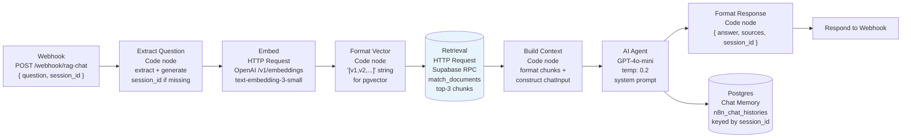

# Phase 3 — Query Pipeline (n8n RAG Workflow)

**Status:** Complete  
**Completed:** 2026-06-13  
**Goal:** Build the n8n workflow that serves as the query pipeline: receives a question via webhook, retrieves relevant document chunks from the vector store, injects them into a prompt, calls GPT-4o-mini, and returns a grounded answer with source citations.

---

## What the query pipeline does

Each time a user asks a question, the query pipeline:

1. Receives the question and a session ID via HTTP POST
2. Embeds the question using the same model used during ingestion (`text-embedding-3-small`)
3. Searches the vector store for the 3 most similar document chunks using cosine similarity
4. Injects those chunks into the AI Agent's prompt as explicit context
5. Calls GPT-4o-mini with a system prompt that constrains answers to retrieved content only
6. Stores the turn in a Postgres memory table keyed by session ID (multi-turn support)
7. Returns `{ answer, sources, session_id }` — the `sources` field is what the eval harness uses to score groundedness



---

## Architecture decision: linear flow over AI Agent tool pattern

The original n8n workflow (from a previous project) used the **AI Agent tool pattern**: the Supabase Vector Store was connected as a callable tool, and the agent decided when to invoke retrieval. This approach was replaced with a **linear flow** for one critical reason.

In the tool pattern, retrieved chunks live inside the agent's intermediate steps — they are not available as first-class output. The eval harness requires a `sources` array in the response containing the actual chunk text it used, so the judge can score **groundedness** (whether claims are traceable to retrieved content). Without explicitly extracting and returning the chunks, the judge receives `"(no sources provided by RAG)"` and scores groundedness at 1 regardless of answer quality.

By doing retrieval as an explicit HTTP Request step before the AI Agent, the chunks are available in the workflow data. They are passed to the AI Agent as injected context in the user message, and separately returned as `sources` in the response.

**The tradeoff:** Two HTTP calls instead of one (embed + retrieve separately), and a longer node chain. The benefit: deterministic retrieval, explicit source attribution, and scores that reflect actual pipeline behaviour.

---

## Node breakdown

### Webhook
- Method: `POST`
- Path: `/rag-chat`
- Response Mode: Response Node

### Extract Question (Code node)
Extracts `question` and `session_id` from the webhook body. Generates a fallback session ID if one is not provided:

```javascript
const body = $input.first().json.body;
return [{
  json: {
    question: body.question,
    session_id: body.session_id || ('sess_' + Date.now() + '_' + Math.random().toString(36).slice(2, 8))
  }
}];
```

### Embed (HTTP Request)
Calls the OpenAI embeddings API directly. The `OpenAI Embeddings` node in n8n is a sub-node only usable inside the AI ecosystem (as a configuration sub-node for the Supabase Vector Store tool). For a regular workflow step, the embeddings API must be called via HTTP Request.

- URL: `https://api.openai.com/v1/embeddings`
- Body: `{ "model": "text-embedding-3-small", "input": "={{ $('Extract Question').first().json.question }}" }`

### Format Vector (Code node)
Converts the returned float array into the pgvector text format `[v1,v2,...]`. This step is necessary because n8n serialises array expressions in JSON templates as comma-separated strings without brackets (e.g. `0.1,-0.2,...`), which PostgreSQL rejects with `invalid input syntax for type vector`. Explicit string formatting sidesteps the implicit cast entirely.

```javascript
const embedding = $('Embed').first().json.data[0].embedding;
return [{
  json: {
    query_embedding: '[' + embedding.join(',') + ']',
    match_count: 3,
    session_id: $('Extract Question').first().json.session_id,
    question: $('Extract Question').first().json.question
  }
}];
```

### Retrieval (HTTP Request)
Calls Supabase's PostgREST RPC endpoint for the `match_documents` function.

- URL: `https://[PROJECT_REF].supabase.co/rest/v1/rpc/match_documents`
- Auth: Bearer Auth (Supabase anon key via n8n credential) + `apikey` header
- Body: `{ "query_embedding": "{{ $json.query_embedding }}", "match_count": 3 }`

**Important:** The anon key must have explicit EXECUTE permission on the function. The ingestion script uses the service role key which bypasses all permissions, so this works during ingestion. The webhook uses the anon key, which does not inherit permissions automatically:

```sql
GRANT EXECUTE ON FUNCTION match_documents TO anon, authenticated;
```

Without this grant, the RPC returns `[]` silently (HTTP 200 with empty body) rather than a 403 error, making the failure invisible.

### Build Context (Code node)
Collects all 3 retrieved items (n8n splits array responses into individual workflow items — `$input.all()` is required, not `$input.first()`), formats them into a context block, and constructs the `chatInput` string that becomes the AI Agent's user message.

```javascript
const question = $('Extract Question').first().json.question;
const session_id = $('Extract Question').first().json.session_id;
const chunks = $input.all().map(item => item.json);

const contextText = chunks
  .map((c, i) => `[${i + 1}] Source: ${c.source_file} — ${c.section}\n${c.content}`)
  .join('\n\n');

return [{
  json: {
    session_id,
    chunks: chunks.map(c => c.content),
    chatInput: `QUESTION: ${question}\n\nRETRIEVED CONTEXT:\n${contextText}`
  }
}];
```

### AI Agent
- Chat Model: OpenAI GPT-4o-mini, temperature 0.2, max tokens 512
- Memory: Postgres Chat Memory → Supabase direct Postgres connection, session key `={{ $json.session_id }}`, window 5 turns
- Prompt (User Message): `={{ $json.chatInput }}`
- No tools — retrieval is handled upstream

**System prompt:**

```
You are BrightPath's HR onboarding assistant. You help new employees understand company policies, benefits, and procedures.

You will receive RETRIEVED CONTEXT documents followed by a QUESTION. Your job is to answer the question using only those documents.

RULES:
1. Answer ONLY from the retrieved context. Do not use outside knowledge.
2. For every factual claim, cite the source — e.g. "According to the Employee Handbook..."
3. If the answer is not in the retrieved context, respond with exactly: "I don't have that information in the company documents. Please contact people@brightpath.io."
4. Never invent numbers, dates, names, or policies.
5. Be concise. New employees need direct, actionable answers.
```

### Format Response (Code node)
Packages the AI Agent's output with the retrieved chunk texts and session ID into the shape the eval harness expects.

```javascript
const answer = $('AI Agent').first().json.output;
const chunks = $('Build Context').first().json.chunks;
const session_id = $('Build Context').first().json.session_id;

return [{
  json: {
    answer,
    sources: chunks,
    session_id
  }
}];
```

The eval harness at `eval/eval.mjs:81–84` reads:
```javascript
answer: data.answer ?? data.text ?? data.output ?? String(data)
sources: data.sources ?? data.chunks ?? []
```

`sources` is the critical field. When it is absent, the judge receives `"(no sources provided by RAG)"` and scores groundedness as 1 regardless of whether the answer is factually correct. Returning actual chunk text enables accurate groundedness scoring.

---

## Problems encountered and solved

### 1. pgvector serialisation — `invalid input syntax for type vector`

n8n's HTTP Request node serialises array expressions embedded in a JSON template as strings without square brackets (`0.1,-0.2,...` instead of `[0.1,-0.2,...]`). PostgreSQL's `vector` type requires the bracketed format. The fix was to introduce the Format Vector code node, which explicitly constructs the string `'[' + embedding.join(',') + ']'` before the retrieval request.

### 2. GRANT EXECUTE — RPC returns `[]` with HTTP 200

The `match_documents` function existed and worked in the SQL editor (using the service role key, which bypasses RLS and function permissions). The webhook used the anon key, which had no EXECUTE grant. Supabase returns an empty array rather than a 403, making this appear as a retrieval failure rather than a permissions error. Running `GRANT EXECUTE ON FUNCTION match_documents TO anon, authenticated` fixed it.

### 3. n8n item model — `chunks.map is not a function`

When Supabase returns `[{...}, {...}, {...}]` via HTTP Request, n8n splits the array into three separate workflow items. `$input.first().json` returns a single object (not an array), so `.map()` fails. Using `$input.all().map(item => item.json)` collects all three items into a plain JavaScript array.

### 4. match_threshold parameter discovery

The Supabase API docs (auto-generated from the schema) showed `match_threshold` as a required parameter. Investigation revealed this reflected a Supabase default pgvector template function rather than the function defined in Phase 2 ([docs/phase-2-ingestion.md](phase-2-ingestion.md#L65)). The deployed function was confirmed to match the Phase 2 schema (no threshold parameter) via `SELECT pg_get_functiondef(...)`.

### 5. Postgres Chat Memory table schema mismatch

The `n8n_chat_histories` table was manually pre-created with a `varchar` id column. n8n's Postgres Chat Memory node expects a `SERIAL` (auto-increment integer) id and does not provide the id value on insert. Dropping the table and letting n8n recreate it on first execution resolved the constraint violation.

### 6. Wrong API key for Retrieval node

The `apikey` header on the Retrieval node initially used the Supabase service role key rather than the anon key. The anon key is the correct key for client-facing API calls.

---

## Manual verification — 2026-06-13

The pipeline was verified by running a test execution in n8n with the question "When does my probation period end?":

| Stage | Result |
|-------|--------|
| Retrieval | 3 chunks returned, Rank 1 contains complete probation policy |
| Build Context | `chatInput` correctly formatted with question + 3 chunks |
| AI Agent | Output: "Your probation period ends 3 months from your start date. According to the New Hire FAQs, there is a formal review at Month 3 attended by your manager and someone from People & Culture." |
| Format Response | `{ answer, sources: [3 chunk texts], session_id }` |

`test-retrieval.mjs` also confirmed retrieval quality for additional questions:
- "How many days of annual leave do I get per year?" → Rank 1 (similarity 0.526) contains "**Entitlement:** 25 days per year"
- "When does enhanced sick pay apply?" → Rank 1 (similarity 0.495) contains the full sick leave policy

---

## Phase 3 completion criteria

| Criterion | Status |
|-----------|--------|
| n8n workflow built with correct linear architecture | ✅ |
| Retrieval returning correct top-3 chunks | ✅ Verified via test-retrieval.mjs |
| AI Agent producing grounded answers in manual test | ✅ Verified in n8n editor |
| Response shape `{ answer, sources, session_id }` | ✅ |
| Postgres Chat Memory connected with session_id keying | ✅ |
| Live eval run passing Phase 4 threshold | ✅ 97% pass rate, 4.87/5 accuracy + groundedness — see [eval-results.md](eval-results.md) |
